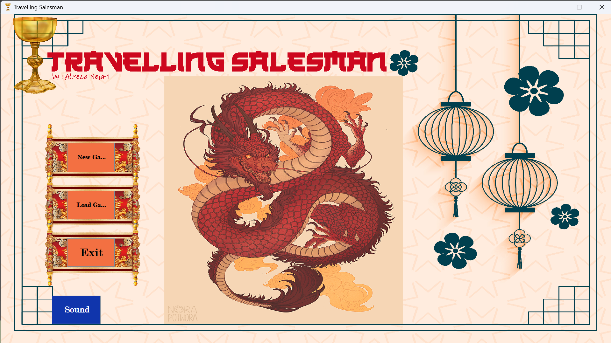
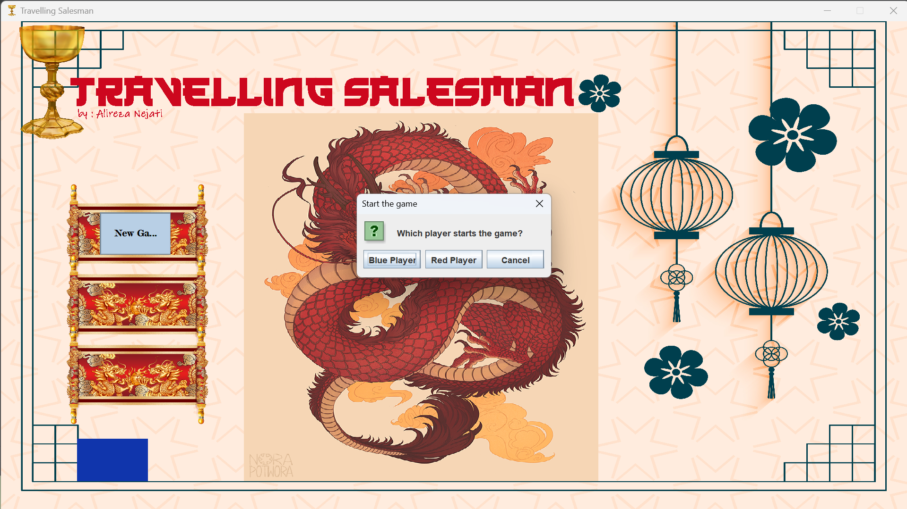

# بازی فروشنده دوره گرد ❏ Travelling Salesman 

بازی Travelling Salesman یک بازی مفرح و به سبک board game است که توسط اینجانب برای پروژه میان ترم درس " برنامه نویسی پیشرفته با زبان Java " در بهار 1403 نوشته شده است  

### شرح پروژه و قوانین بازی : 

در ابتدا باید این نکته را عرض کنم که برای تجربه بهتر بازی لطفا به قسمت Display Settings سیستم عامل خود بروید و گزینه Scale را روی 150% و Display Resolution خود را روی 1920x1080 تنظیم کنید !

پس از ران کردن پروژه با صفحه منوی بازی روبرو می شویم که دارای سه Button اصلی New Game , Load Game و Exit است و علاوه بر این 3 مورد در قسمت پایین و چپ اسکرین گزینه ای برای قطع یا وصل کردن صدای بازی تعبیه شده است .   

پس از فشردن دکمه "New Game" , یک Selection Dialog باز می شود که از کاربر می خواهد مشخص کند که کدام بازیکن اولین دفعه تاس را بریزد و حرکت روی صفحه را شروع کند 

# فایل reade me در حال تکمیل شدن است و این نسخه ، نسخه کامل شده نیست !!!! 
